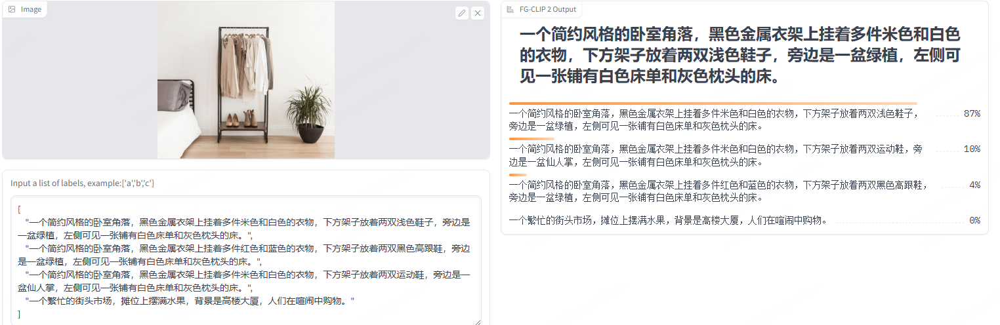

---
language:
- en
- zh
library_name: transformers
license: apache-2.0
pipeline_tag: zero-shot-image-classification
tags:
- clip
---

# FG-CLIP 2: A Bilingual Fine-grained Vision-language Alignment Model

Code: https://github.com/360CVGroup/FG-CLIP
Project page: https://360cvgroup.github.io/FG-CLIP

FG-CLIP 2 is the foundation model for fine-grained vision-language understanding in both English and Chinese. 
Across 29 datasets and 8 diverse tasks, it consistently surpasses recent strong baselines such as SigLIP 2 and MetaCLIP 2, achieving the best reported performance to date in both languages. 

**[FG-CLIP 2: A Bilingual Fine-grained Vision-language Alignment Model](https://arxiv.org/abs/2510.10921)** 
</br>
Chunyu Xie*, Bin Wang*, Fanjing Kong, Jincheng Li, Dawei Liang, Ji Ao, Dawei Leng†, Yuhui Yin(*Equal Contribution, †Corresponding Author)
</br>
[](https://arxiv.org/abs/2510.10921)
[](https://huggingface.co/collections/qihoo360/fg-clip-2-68ecbf9c548623bb78bc7913)
[](https://huggingface.co/collections/qihoo360/fg-clip-2-68ecbf9c548623bb78bc7913)
[](https://research.360.cn/sass/index)

**[FG-CLIP: Fine-Grained Visual and Textual Alignment](https://arxiv.org/abs/2505.05071)** ([code branch: v1.0](https://github.com/360CVGroup/FG-CLIP/tree/v1.0))
</br>
Chunyu Xie*, Bin Wang*, Fanjing Kong, Jincheng Li, Dawei Liang, Gengshen Zhang, Dawei Leng†, Yuhui Yin (*Equal Contribution, †Corresponding Author)
</br>
[](https://arxiv.org/abs/2505.05071)
[](https://icml.cc/Conferences/2025)
[](https://huggingface.co/collections/qihoo360/fg-clip-681da45d4acfb65c240a6d08)
[](https://huggingface.co/datasets/qihoo360/FineHARD)
[![DeepWiki](https://img.shields.io/badge/DeepWiki-FG--CLIP-blue.svg?logo=data:image/png;base64,iVBORw0KGgoAAAANSUhEUgAAACwAAAAyCAYAAAAnWDnqAAAAAXNSR0IArs4c6QAAA05JREFUaEPtmUtyEzEQhtWTQyQLHNak2AB7ZnyXZMEjXMGeK/AIi+QuHrMnbChYY7MIh8g01fJoopFb0uhhEqqcbWTp06/uv1saEDv4O3n3dV60RfP947Mm9/SQc0ICFQgzfc4CYZoTPAswgSJCCUJUnAAoRHOAUOcATwbmVLWdGoH//PB8mnKqScAhsD0kYP3j/Yt5LPQe2KvcXmGvRHcDnpxfL2zOYJ1mFwrryWTz0advv1Ut4CJgf5uhDuDj5eUcAUoahrdY/56ebRWeraTjMt/00Sh3UDtjgHtQNHwcRGOC98BJEAEymycmYcWwOprTgcB6VZ5JK5TAJ+fXGLBm3FDAmn6oPPjR4rKCAoJCal2eAiQp2x0vxTPB3ALO2CRkwmDy5WohzBDwSEFKRwPbknEggCPB/imwrycgxX2NzoMCHhPkDwqYMr9tRcP5qNrMZHkVnOjRMWwLCcr8ohBVb1OMjxLwGCvjTikrsBOiA6fNyCrm8V1rP93iVPpwaE+gO0SsWmPiXB+jikdf6SizrT5qKasx5j8ABbHpFTx+vFXp9EnYQmLx02h1QTTrl6eDqxLnGjporxl3NL3agEvXdT0WmEost648sQOYAeJS9Q7bfUVoMGnjo4AZdUMQku50McDcMWcBPvr0SzbTAFDfvJqwLzgxwATnCgnp4wDl6Aa+Ax283gghmj+vj7feE2KBBRMW3FzOpLOADl0Isb5587h/U4gGvkt5v60Z1VLG8BhYjbzRwyQZemwAd6cCR5/XFWLYZRIMpX39AR0tjaGGiGzLVyhse5C9RKC6ai42ppWPKiBagOvaYk8lO7DajerabOZP46Lby5wKjw1HCRx7p9sVMOWGzb/vA1hwiWc6jm3MvQDTogQkiqIhJV0nBQBTU+3okKCFDy9WwferkHjtxib7t3xIUQtHxnIwtx4mpg26/HfwVNVDb4oI9RHmx5WGelRVlrtiw43zboCLaxv46AZeB3IlTkwouebTr1y2NjSpHz68WNFjHvupy3q8TFn3Hos2IAk4Ju5dCo8B3wP7VPr/FGaKiG6T+v+TQqIrOqMTL1VdWV1DdmcbO8KXBz6esmYWYKPwDL5b5FA1a0hwapHiom0r/cKaoqr+27/XcrS5UwSMbQAAAABJRU5ErkJggg==)](https://deepwiki.com/360CVGroup/FG-CLIP)

<p align="center">
  
</p>

## Quick Start 🤗

### Load Model
```python
import torch
from PIL import Image
from transformers import (
    AutoImageProcessor,
    AutoTokenizer,
    AutoModelForCausalLM,
)


model_root = "qihoo360/fg-clip2-base"
model = AutoModelForCausalLM.from_pretrained(model_root,trust_remote_code=True).cuda()

device = model.device

tokenizer = AutoTokenizer.from_pretrained(model_root)
image_processor = AutoImageProcessor.from_pretrained(model_root)

```


### Retrieval

```python
def determine_max_value(image):
    w,h = image.size
    max_val = (w//16)*(h//16)
    if max_val > 784:
        return 1024
    elif max_val > 576:
        return 784
    elif max_val > 256:
        return 576
    elif max_val > 128:
        return 256
    else:
        return 128

img_root = "cat_dfclor.jpg"
image = Image.open(img_root).convert("RGB")

image_input = image_processor(images=image, max_num_patches=determine_max_value(image), return_tensors="pt").to(device)

# NOTE Short captions: max_length=64 walk_type="short"(default)
# NOTE Long captions: max_length=196 walk_type="long"

captions = [
"一个简约风格的卧室角落，黑色金属衣架上挂着多件米色和白色的衣物，下方架子放着两双浅色鞋子，旁边是一盆绿植，左侧可见一张铺有白色床单和灰色枕头的床。",
"一个简约风格的卧室角落，黑色金属衣架上挂着多件红色和蓝色的衣物，下方架子放着两双黑色高跟鞋，旁边是一盆绿植，左侧可见一张铺有白色床单和灰色枕头的床。",
"一个简约风格的卧室角落，黑色金属衣架上挂着多件米色和白色的衣物，下方架子放着两双运动鞋，旁边是一盆仙人掌，左侧可见一张铺有白色床单和灰色枕头的床。",
"一个繁忙的街头市场，摊位上摆满水果，背景是高楼大厦，人们在喧闹中购物。"
]
captions = [caption.lower() for caption in captions]

caption_input = tokenizer(captions, padding="max_length", max_length=196, truncation=True, return_tensors="pt").to(device)


with torch.no_grad():
  image_feature = model.get_image_features(**image_input)
  text_feature = model.get_text_features(**caption_input,walk_type="long")
  image_feature = image_feature / image_feature.norm(p=2, dim=-1, keepdim=True)
  text_feature = text_feature / text_feature.norm(p=2, dim=-1, keepdim=True)

logits_per_image = image_feature @ text_feature.T
logit_scale, logit_bias = model.logit_scale.to(text_feature.device), model.logit_bias.to(text_feature.device)
logits_per_image = logits_per_image * logit_scale.exp() + logit_bias
# The original Github example does not print probabilities for retrieval, keeping consistency.
```
 <p align="left">
  
</p>

### Dense feature effect display

```python

import math
import matplotlib
matplotlib.use('Agg') 
import matplotlib.pyplot as plt

def resize_short_edge(image, target_size=2048):

    if isinstance(image, str):
        image = Image.open(image)
    
    width, height = image.size
    short_edge = min(width, height)

    if short_edge >= target_size:
        return image

    scale = target_size / short_edge
    new_width = int(width * scale)
    new_height = int(height * scale)

    resized_image = image.resize((new_width, new_height))
    
    return resized_image

img_root = "cat_dfclor.jpg"
image = Image.open(img_root).convert("RGB")
# The 'resize_short_edge' function is not defined in the snippet or provided context.
# Assuming 'cat_dfclor.jpg' is pre-processed or the model handles sizing.
# image = resize_short_edge(image,target_size=2048) 

image_input = image_processor(images=image, max_num_patches=16384, return_tensors="pt").to(device)
captions = ["电脑","黑猫","窗户","window","white cat","book"]

with torch.no_grad():
    dense_image_feature = model.get_image_dense_feature(**image_input)
    
    spatial_values = image_input["spatial_shapes"][0]
    real_h = spatial_values[0].item()
    real_w = spatial_values[1].item()
    real_pixel_tokens_num = real_w*real_h
    dense_image_feature = dense_image_feature[0][:real_pixel_tokens_num]
    captions = [caption.lower() for caption in captions]
    caption_input = tokenizer(captions, padding="max_length", max_length=64, truncation=True, return_tensors="pt").to(device)

    text_feature = model.get_text_features(**caption_input, walk_type="box")
    text_feature = text_feature / text_feature.norm(p=2, dim=-1, keepdim=True)
    dense_image_feature = dense_image_feature / dense_image_feature.norm(p=2, dim=-1, keepdim=True)

similarity = dense_image_feature @ text_feature.T
similarity = similarity.cpu()


num_classes = len(captions)
cols = 3
rows = (num_classes + cols - 1) // cols


aspect_ratio = real_w / real_h 

fig_width_inch = 3 * cols        
fig_height_inch = fig_width_inch / aspect_ratio * rows / cols  

fig, axes = plt.subplots(rows, cols, figsize=(fig_width_inch, fig_height_inch))
fig.subplots_adjust(wspace=0.01, hspace=0.01)

if num_classes == 1:
    axes = [axes]
else:
    axes = axes.flatten()

for cls_index in range(num_classes):
    similarity_map = similarity[:, cls_index].cpu().numpy()
    show_image = similarity_map.reshape((real_h, real_w))

    ax = axes[cls_index]
    ax.imshow(show_image, cmap='viridis', aspect='equal')  
    ax.set_xticks([])
    ax.set_yticks([])
    ax.axis('off')


for idx in range(num_classes, len(axes)):
    axes[idx].axis('off')

savename = "FGCLIP2_dfcolor_cat_all_2K.png"
plt.savefig(savename, dpi=150, bbox_inches='tight', pad_inches=0.05)
plt.close()
```

 <p align="left">
  
</p>

## Citation
If you find FG-CLIP 2 useful for your research and applications, please cite using this BibTeX:

```
@article{xie2025fg2,
  title={FG-CLIP 2: A Bilingual Fine-grained Vision-language Alignment Model},
  author={Xie, Chunyu and Wang, Bin and Kong, Fanjing and Li, Jincheng and Liang, Dawei and Ao, Ji and Leng, Dawei and Yin, Yuhui},
  journal={arXiv preprint arXiv:2510.10921},
  year={2025}
}
```
```
@article{xie2025fg,
  title={FG-CLIP: Fine-Grained Visual and Textual Alignment},
  author={Xie, Chunyu and Wang, Bin and Kong, Fanjing and Li, Jincheng and Liang, Dawei and Zhang, Gengshen and Leng, Dawei and Yin, Yuhui},
  journal={arXiv preprint arXiv:2505.05071},
  year={2025}
}
```


## License

This project utilizes certain datasets and checkpoints that are subject to their respective original licenses. Users must comply with all terms and conditions of these original licenses.
The content of this project itself is licensed under the [Apache license 2.0](./LICENSE).